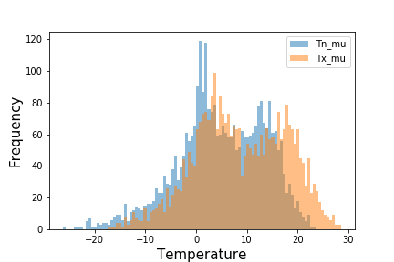
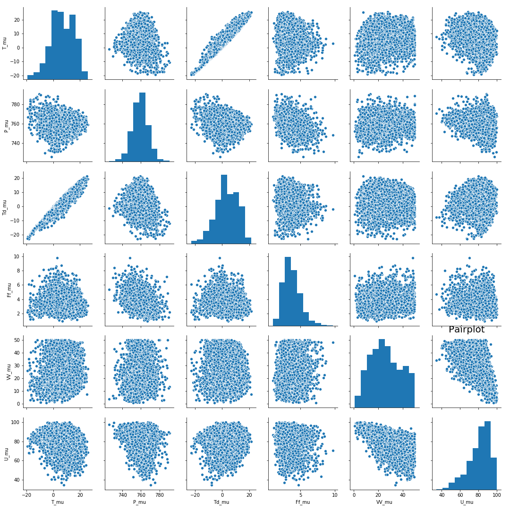
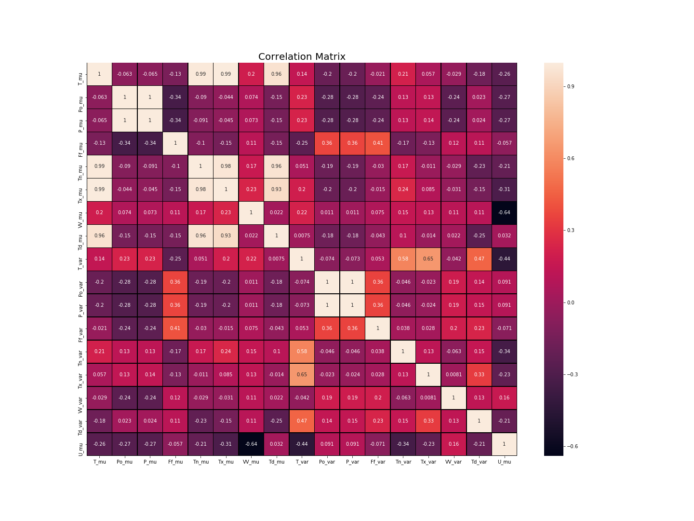
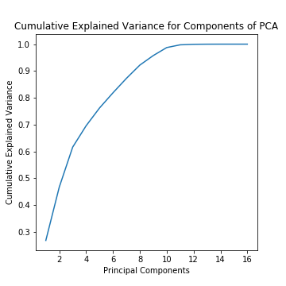
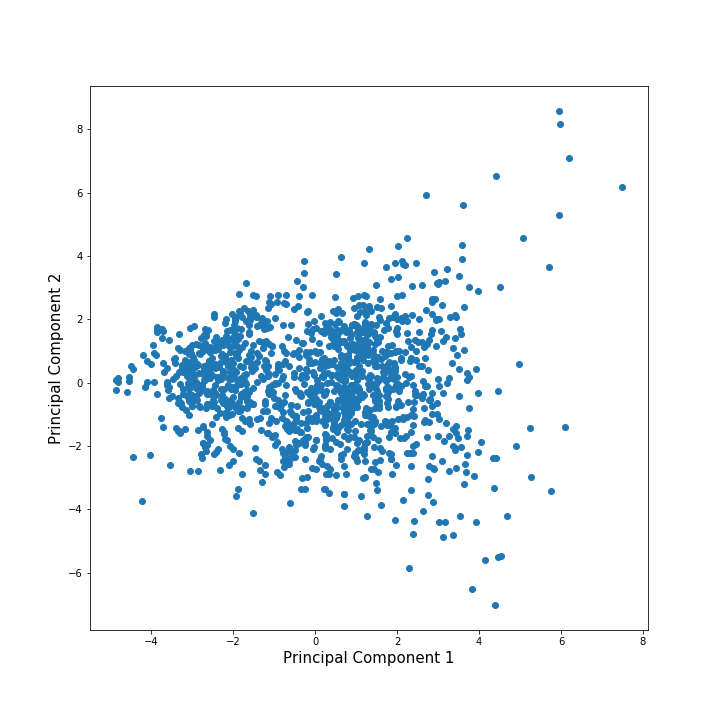
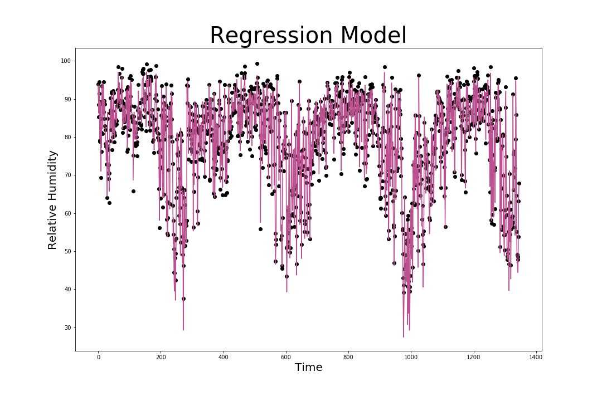
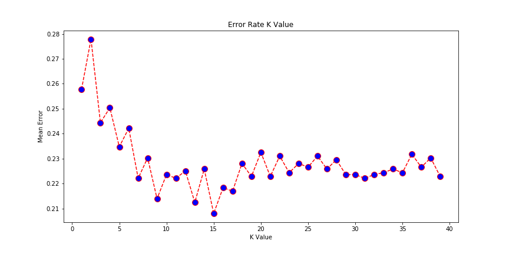
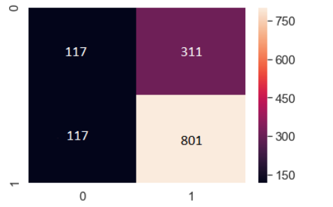
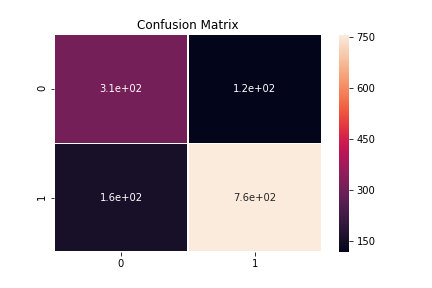

# Predicting Helsinki's Humidity Levels using Station Weather Data and Identifying the Relationship between Humidity and other Weather Attributes

    by Atreya Ray and Long Nguyen

---

### Abstract

The objective of the project was to find the relative between humidity and different weather attributes using regression and linear models and ultimately identify which attributes were the strongest humidity predictors. Another goal was to classify the weather as “dry” or “not dry” based on the given measurements. We used the KNN-algorithm to accomplish this task. One major issue which arose during the project was that the data set was high dimensional, 17 to be exact, which made the analysis complex and created more obstacles to develop a reliable classification model and increase the risk producing poor quality clusters. PCA was utilised to reduce the dimensionality of  the data by creating a new set of attributes that better captured the variability of the data. With this new attribute set, the data became less sparse in the space it occupied, and as a result, better and more accurate predictions could be achieved. 

---

### Introduction

Weather forecasting has an enormous impact on a daily basis for everybody as we usually plan our activities based on the expectation of the weather conditions presented by forecasts. Inaccurate predictions not only negatively affect our personal plans but can also bring  tremendous inconveniences and loss on a larger scale. Therefore, the need for accuracy and reliable weather forecasts is clear. However, predicting the patterns of weather has never been an easy task. In fact, it is extremely hard as each weather phenomenon is the result of combination of many other weather attributes. In this report, we will focus on predicting the humidity - one of the most crucial weather patterns in Finland - of a day based on the measurements of some given numerical attributes. 
The dataset used was provided by the 2978 weather station in Helsinki, which consists of over 4000 daily measurements of 17 different attributes. We will exploit this dataset with the toolbox from some of Python’s libraries - panda, numpy, sklearn and seaborn. The linear model will be useful in the finding of the connection between humidity and common weather attributes as well as identifying the strongest predictors among them. Meanwhile, the regression model is best suited for prediction as the dataset of 2978 is recorded on a continuous scale. KNN-algorithm comes in handy for the classification task where we indicate whether that day is dry or not.
In the following parts of the report, we will explain and discuss our methods, the produced results - whether they are concise and reliable or not - and conclusions. 
 
---

### Data Analysis

The data consisted of measurements by the weather station 2978 in Helsinki from 2006 to May 2019, downloaded from the website http://rp5.ru/. It had 17 numerical attributes, all of which had been labelled. The entire dataset was divided into two sets, one was used for training and the other one for testing.  “T” represents the temperature of the air 2 meters above the earth’s surface. “Tn” and “Tx”, respectively, are the labels of the minimum and maximum air temperature over the past day. Also with respect to the temperature attributes, “Td” is the dew point temperature at a height of 2 meters above the earth’s surface. “Po” and “P” are labelled as the atmospheric pressure at weather station level and the atmospheric pressure reduced to mean sea level respectively (in millimetres of mercury). The mean wind speed, in meters per second, at a height of 10 to 12 meters above the earth’s surface, will be denoted by “Ff”. “VV” is the horizontal visibility in kilometres, and “U” is the percentage of relative humidity 2 meters above the earth’s surface. The categorical variable “OBSERVED” indicates the amount of precipitation is larger than 0.3 millimetres if the returned value is 0, and little or no precipitation if the returned value is 1. Together all these attributes covered the main factors used for forecasting and predicting weather conditions. 

---

### Plots

Data exploration was done using histograms, pair plots, and a correlation matrix. 

Figure 1 showed that both the distributions were bimodal due to the seasonal nature of temperature.

The plots showed a strong correlation between T_mu and Td_mu which appeared to be a positive correlation. Overall, there were no significant observations from the pair plot.

Figure 3 was extremely interesting as it showed a negative correlation between the relative humidity and the horizontal visibility. An increase in the 
humidity leads to reduced horizontal visibility. Additionally, the wind speed (Ff) had an extremely weak correlation with the relative humidity which deemed it an insignificant factor.

---

### PCA

To reduce the dimensionality of the data, PCA was applied. Data was scaled in [-1,1] and then the inbuilt class PCA of sklearn.decomposition was used to generate 16 components of PCA. Plotting the explained variance for components of PCA showed that PC 1 described 26.85% of the variance while including PC 2 increased the spread of variance to 46.71%. The 95% mark for cumulative variance explained was reached at PC 9 while 99% of the variance was described at PC 11.

Cumulative explained variance for the various components was:

   
0.2698555118733149	 
0.44995910563699
0.604714956368203
0.6947744305866641
0.7623981826675998
0.818861933617128
0.8709540862971437
0.9187512853485493
0.9573101576530113
0.9872436617521955
0.9968611304730552
0.9994234882083479
0.9998831818071945
0.9999979496937165
0.9999999382029308
0.9999999999999999

Additionally, the PCA projection to the first 2 components was generated as follows:

---
### Methods

We used multiple linear regression for all variables using the inbuilt methods in sklearn.linear_model.LinearRegression(). Furthermore, we standardised data to a distribution with mean 0 and variance 1. The Regression model was generated using the Least Squares method which optimally minimises the sum of squared distances of the actual points from the predicted values.

Additionally, we used the KNN supervised learning method to classify the data into ‘wet’ or 'dry'. Using the error rates of k, we determined the optimal number of nearest neighbours for accurate clustering. Here too, we used the inbuilt methods of sklearn.decomposition.PCA to generate the results.

Lastly, we used the data with reduced dimensionality (through PCA) for the KNN classifier. From the data with 16 dimensions, we only picked 2 Principal Components and generated the confusion matrix for it.

---
### Experiments and Results

The multiple linear regression model generated had the coefficients:

-4.37863567e+00
 9.58574486e-01
-9.86675980e-01
-2.07551005e-01
 2.78131793e-01
-3.37839112e-01
-6.27401941e-02
 4.55441867e+00
 5.60519848e-02
 1.59683856e-01
-1.54021900e-01
-2.64359894e-02
 4.41774361e-02
-8.67669196e-03
 8.28122077e-04
 4.66677141e-02

The mean squared error of this linear regression model was calculated to be: 2.4295688076984123 % which was an acceptable margin of error from the actual values of the test set.

---

---

For the KNN classifier, we determined the optimal number for the nearest neighbours to be 15 where the error in classifying would be least.

---

---

Applying the KNN classifier, we determined the accuracy of the classifier to be 79%.
Confusion matrix generated after PCA was 69% accurate.

---
### Conclusion

The most elementary prediction method, multiple regression yielded the best results with an error of approximately 2.429%. As the value of the error rate was within an acceptable range, our model is a fairly accurate model to predict the relative humidity of Helsinki. The weights of the different factors were also determined by the coefficients of the model which pointed out that the mean temperature and dewpoint temperature were the single largest factors affecting the relative humidity. Another noteworthy factor included the atmospheric pressure variable. With PCA, there was a small drop in the accuracy of the classifier with an accuracy of around 69%. The drop in the accuracy was due to the fact that the cumulative variance described by the first two principal components was less than 50%.

---
### References and Links

(https://scikit-learn.org/stable/modules/generated/sklearn.decomposition.PCA.html)
(https://scikit-learn.org/stable/modules/generated/sklearn.neighbors.KNeighborsClassifier.html)
(https://scikit-learn.org/stable/modules/generated/sklearn.preprocessing.StandardScaler.html)
(https://seaborn.pydata.org/generated/seaborn.heatmap.html)
(https://scikit-learn.org/stable/modules/generated/sklearn.linear_model.LinearRegression.htmlhttps://pandas.pydata.org/pandas-docs/stable/reference/api/pandas.concat.html)
(https://docs.scipy.org/doc/numpy/reference/generated/numpy.array.html)
(https://matplotlib.org/3.1.1/api/_as_gen/matplotlib.pyplot.plot.html)
(https://matplotlib.org/3.1.1/api/_as_gen/matplotlib.pyplot.hist.html)
(https://seaborn.pydata.org/generated/seaborn.pairplot.html)

