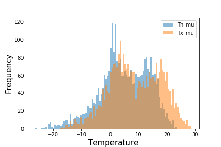

# Predicting Helsinki's Humidity Levels using Station Weather Data and Identifying the Relationship between Humidity and other Weather Attributes

    by Atreya Ray and Long Nguyen

---

### Abstract

The objective of the project was to find the relative between humidity and different weather attributes using regression and linear models and ultimately identify which attributes were the strongest humidity predictors. Another goal was to classify the weather as “dry” or “not dry” based on the given measurements. We used the KNN-algorithm to accomplish this task. One major issue which arose during the project was that the data set was high dimensional, 17 to be exact, which made the analysis complex and created more obstacles to develop a reliable classification model and increase the risk producing poor quality clusters. PCA was utilised to reduce the dimensionality of  the data by creating a new set of attributes that better captured the variability of the data. With this new attribute set, the data became less sparse in the space it occupied, and as a result, better and more accurate predictions could be achieved. 

---

### Introduction

Weather forecasting has an enormous impact on a daily basis for everybody as we usually plan our activities based on the expectation of the weather conditions presented by forecasts. Inaccurate predictions not only negatively affect our personal plans but can also bring  tremendous inconveniences and loss on a larger scale. Therefore, the need for accuracy and reliable weather forecasts is clear. However, predicting the patterns of weather has never been an easy task. In fact, it is extremely hard as each weather phenomenon is the result of combination of many other weather attributes. In this report, we will focus on predicting the humidity - one of the most crucial weather patterns in Finland - of a day based on the measurements of some given numerical attributes. 
The dataset used was provided by the 2978 weather station in Helsinki, which consists of over 4000 daily measurements of 17 different attributes. We will exploit this dataset with the toolbox from some of Python’s libraries - panda, numpy, sklearn and seaborn. The linear model will be useful in the finding of the connection between humidity and common weather attributes as well as identifying the strongest predictors among them. Meanwhile, the regression model is best suited for prediction as the dataset of 2978 is recorded on a continuous scale. KNN-algorithm comes in handy for the classification task where we indicate whether that day is dry or not.
In the following parts of the report, we will explain and discuss our methods, the produced results - whether they are concise and reliable or not - and conclusions. 
 
---

### Data Analysis

The data consisted of measurements by the weather station 2978 in Helsinki from 2006 to May 2019, downloaded from the website http://rp5.ru/. It had 17 numerical attributes, all of which had been labelled. The entire dataset was divided into two sets, one was used for training and the other one for testing.  “T” represents the temperature of the air 2 meters above the earth’s surface. “Tn” and “Tx”, respectively, are the labels of the minimum and maximum air temperature over the past day. Also with respect to the temperature attributes, “Td” is the dew point temperature at a height of 2 meters above the earth’s surface. “Po” and “P” are labelled as the atmospheric pressure at weather station level and the atmospheric pressure reduced to mean sea level respectively (in millimetres of mercury). The mean wind speed, in meters per second, at a height of 10 to 12 meters above the earth’s surface, will be denoted by “Ff”. “VV” is the horizontal visibility in kilometres, and “U” is the percentage of relative humidity 2 meters above the earth’s surface. The categorical variable “OBSERVED” indicates the amount of precipitation is larger than 0.3 millimetres if the returned value is 0, and little or no precipitation if the returned value is 1. Together all these attributes covered the main factors used for forecasting and predicting weather conditions. 

---

### Plots

Data exploration was done using histograms, pair plots, and a correlation matrix. 

